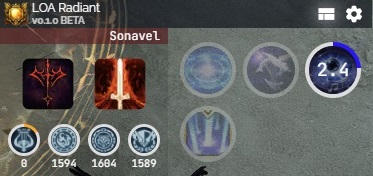
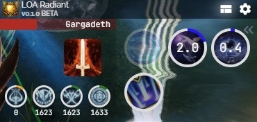
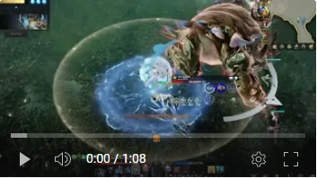

# LOA Radiant

**Beta Pre-Release.** Lost Ark support overlay for tracking attack buffs, brand duration and selected skills duration using the [`meter-core`](https://github.com/lost-ark-dev/meter-core) packet parser.




## Features

- Track remaining time on important skills
- Track remaining time on attack buff and brand buff
- Flashing alerts when attack buffs and brand is about to expire

## Demo

**Gargadeth Bard POV**

[](https://youtu.be/wYwDhsH4ALM)

**Sonavel Bard POV**

[](https://youtu.be/wqt-OboX2aA)

## Development

```
git clone --recurse-submodules https://github.com/xenonchi/loa-radiant
```

**Install Packages**
- For windows, you need [Npcap with WinPcap compatibilities](https://npcap.com/#download)
- In `pkt` and `ui`, run `npm i` to install packages
- In `ui/node_modules/.bin`, run `.\electron-rebuild.cmd --module-dir ../..` to rebuild broken packages

**Dev**
- In `pkt`, run `npm run build-dist`
- Copy `pkt/dist/api.js` to `ui/electron/pkt/api.cjs`
- In `ui`, run `npm run dev` to launch the Svelte app

**Build**
- In `pkt`, run `npm run build-dist`
- Copy `pkt/dist/api.js` to `ui/electron/pkt/api.cjs`
- In `ui`, run `npm run make` build the executable
- Run the `.exe`
