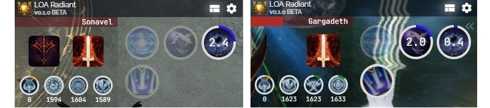

# LOA Radiant

**Beta Pre-Release.** Lost Ark support overlay for tracking attack buffs, brand duration and selected skills duration using the [`meter-core`](https://github.com/lost-ark-dev/meter-core) packet parser.




## Features

1. Alerts are flashing if the attack buff is about to expire on a party member or the brand is about to expire on a boss
2. Remaining brand duration on the boss
3. Remaining attack buff duration on party members
4. Remaining duration on important skills\
&nbsp;&nbsp;&nbsp;&nbsp;4.1. Inactive skills are more opaque\
&nbsp;&nbsp;&nbsp;&nbsp;4.2. Active skills show remaining duration\
&nbsp;&nbsp;&nbsp;&nbsp;4.3. Casting skills rotate

**Settings**
- The attack buff and brand alert threshold can be changed in the settings.
- The duration required to fill the bar or circle can be changed in the settings.

## Demo

**Gargadeth Bard POV**

[](https://youtu.be/wYwDhsH4ALM)

**Sonavel Sorceress POV, Artist Support**

[](https://youtu.be/CjxQXq0VegQ)

## Contact

Discord: 2385 (Xenon)

## Development

```
git clone --recurse-submodules https://github.com/xenonchi/loa-radiant
```

**Requirements**
- For Windows, [Npcap with WinPcap compatibilities](https://npcap.com/#download)
- [Node](https://nodejs.org/en/download) v20.6.1 or higher
- [Python](https://www.python.org/downloads/) v3.10 or higher
    - Run `pip install setuptools`

**Install Packages**
- In `pkt`, run `npm i` to install node modules
- In `ui`, run `npm i` to install node modules
- In `ui`, run `npx electron-rebuild` to rebuild modules compiled in a different Node.js version

**Dev**
- In `pkt`, run `npm run build-dist`
- Copy `pkt/dist/api.js` to `ui/electron/pkt/api.cjs`
- In `ui`, run `npm run dev` to launch the Svelte app

**Build**
- In `pkt`, run `npm run build-dist`
- Copy `pkt/dist/api.js` to `ui/electron/pkt/api.cjs`
- In `ui`, run `npm run make` to build the executable
- In `ui/out/LOA-Radiant-win32-x64`, run `LOA-Radiant.exe`